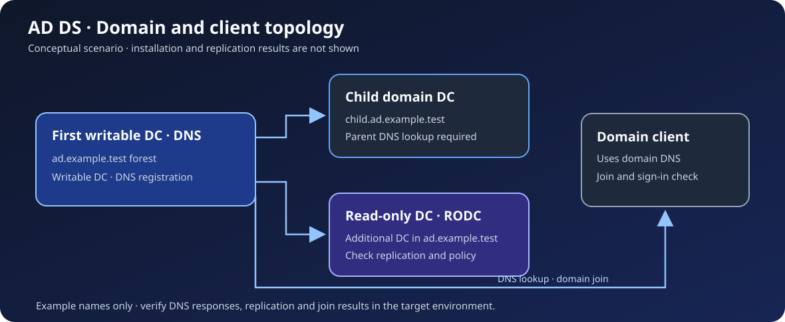

# Windows Server 역할 구성과 점검

Active Directory Domain Services(AD DS), DNS, DHCP, IIS와 FTP의 역할을 연결해 보는 Windows Server 실습 문서입니다. 도메인 컨트롤러와 클라이언트의 의존 관계, 역할 설치 뒤 확인할 상태를 정리했습니다. 배포 스크립트나 실제 서버의 실행 결과는 포함하지 않습니다.

## 구성 관계

| 영역 | 구성 시나리오 | 확인할 내용 |
|---|---|---|
| AD DS | 새 포리스트의 첫 도메인 컨트롤러, 자식 도메인 컨트롤러, 읽기 전용 도메인 컨트롤러(RODC), 도메인 가입 클라이언트 | DNS 조회와 도메인 가입·복제 상태의 확인 지점 |
| DNS·DHCP | DNS 존과 레코드, DHCP IPv4 범위 | 클라이언트의 이름 조회·주소·기본 경로·DNS 설정 |
| IIS·FTP | 웹 사이트 바인딩과 기본 문서, 별도 FTP 서비스 | 서비스 상태, 응답, 인증과 접근 권한 |

AD DS의 논리 예시는 `ad.example.test` 포리스트와 `child.ad.example.test` 자식 도메인입니다. 두 이름은 설명용이며 실제 도메인이나 인증 정보가 아닙니다. [AD DS 구성 관계](docs/ad-lab.md)에서 서버 역할과 DNS 선행 조건을, [서비스별 점검](docs/service-checks.md)에서 DNS·DHCP·IIS·FTP의 확인 순서를 설명합니다.

## 적용·검증 경계

이 문서는 구성 시나리오와 **검증 절차**를 제시합니다. 실제 서버에 역할을 설치한 로그, 복제 결과, DHCP 임대나 HTTP 응답을 이 저장소의 완료 결과로 주장하지 않습니다. 대상 OS 버전, 네트워크, 권한을 먼저 확인하고 GUI 화면과 명령 결과를 별도로 기록해야 합니다. FTP의 익명 업로드를 공개 서비스의 권장 설정으로 사용하지 않습니다.

Windows Server 2012 R2의 일반 연장 지원은 2023년 10월 10일 종료됐습니다. 새 실습에서는 지원 중인 Windows Server 버전과 해당 버전의 [AD DS 설치 안내](https://learn.microsoft.com/en-us/windows-server/identity/ad-ds/deploy/install-active-directory-domain-services--level-100-)를 확인합니다. [Microsoft 지원 수명 주기](https://learn.microsoft.com/en-us/lifecycle/announcements/windows-server-2012-r2-end-of-support)
